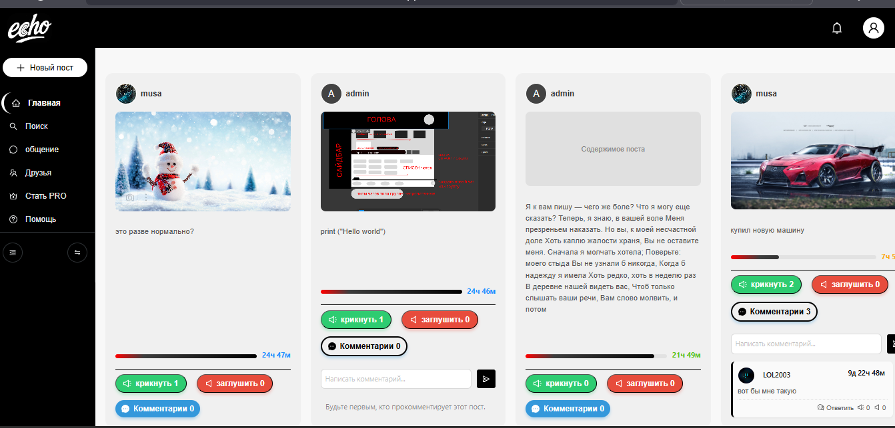

# Echo

## МОЙ АКАДЕМИЧЕСКИЙ ПРОЕКТ ДЛЯ C++ & ДИПЛОМНАЯ РАБОТА

Социальная сеть, где всё течёт, всё изменяется, и ничто не вечно

[](https://python.org)
[](https://djangoproject.com)
[](https://www.django-rest-framework.org)
[](https://postgresql.org)

## ✨ Особенности



### ⏳ Динамическая временная механика

- **24 часа жизни** у поста
- **240 часов существования** у комментария
- **Каждое "Эхо"** продлевает жизнь на +1 час
- **Каждое "Раз эхо"** сокращает время на -1 час

### 🎮 Уникальное взаимодействие

**Плавучие комментарии**  
Когда пост исчезает, его комментарии отделяются от контекста и начинают самостоятельное «плавание» по ленте как загадочные послания без берегов (в разработке).

**Горизонтальный скролл**  
Свайп вправо → следующий пост  
Свайп влево → предыдущий пост  
Вертикали нет → привыкай к новому формату

### 🛠 Технологический стек

Backend

- Python 3.11+ — основной язык
- Django 4.2+ — веб‑фреймворк
- Django REST Framework — REST API
- PostgreSQL — база данных

Frontend

- Web — React / Next.js

Mobile (в разработке)

- iOS/Android — в будущем — Flutter

### 💡 Ключевые модели

Пользователь

```python
class CustomUser(AbstractUser):
    phone = models.CharField(unique=True)
    email = models.EmailField(unique=True)
    nickname = models.CharField()
    avatar = models.ImageField()
    is_pro = models.BooleanField(default=False)
```

Пост

```python
class Post(models.Model):
    author = models.ForeignKey(User)
    content = models.TextField(max_length=500)
    image = models.ImageField()
    created_at = models.DateTimeField(auto_now_add=True)
    expires_at = models.DateTimeField()
    echo_count = models.IntegerField(default=0)
    disecho_count = models.IntegerField(default=0)
```

🎨 PRO подписка (в разработке)

Преимущества для PRO пользователей:

- ✅ Синяя галочка верификации
- Кастомные цветовые схемы
- 🔄 МегаЭхо (+6 часов вместо +1)
- ✨ GIF‑аватарки
- 😊 Пользовательские эмодзи
- 📊 Расширенная статистика
- 💾 Личный архив "Капсула времени"

#### 📄 Лицензия

Этот проект лицензирован под MIT License — см. файл LICENSE для деталей.

#### 👥 Авторы

[Papr317](https://github.com/papr317)
